<p align="center">
  
</p>

<div align="center">

# Muhammad Raza Bangi

### Senior Software Engineer • Backend Engineer • Laravel Specialist

**Building scalable backend systems, SaaS products, APIs, automation and developer tools.**

[](https://muhammadrazabangi.com)
[](https://www.linkedin.com/in/muhammad-raza-bangi/)
[](https://dev.to/razabangi)
[](mailto:muhammadrazabangi9@gmail.com)

</div>

---

## `root@razabangi:~$ whoami`

```php
<?php

namespace RazaBangi;

class Developer extends SoftwareEngineer
{
    public string $name = 'Muhammad Raza Bangi';

    public string $role = 'Senior Software Engineer';

    public string $primaryStack = 'Laravel';

    public array $focus = [
        'Backend Engineering',
        'System Architecture',
        'SaaS Development',
        'REST APIs',
        'Automation',
        'Developer Tools',
    ];

    public array $currentlyExploring = [
        'AI-powered applications',
        'Scalable SaaS Architecture',
        'System Design',
        'Developer Experience',
    ];

    public function mission(): string
    {
        return 'Build software that is fast, scalable, maintainable and useful.';
    }
}
```

---

# `> system.profile`

```yaml
developer:
  name: Muhammad Raza Bangi
  role: Senior Software Engineer
  location: Pakistan

specialization:
  - Backend Engineering
  - Laravel Architecture
  - SaaS Development
  - REST APIs
  - Automation
  - System Design

primary_stack:
  backend:
    - Laravel
    - PHP
    - Node.js
    - NestJS
    - Python

  frontend:
    - Next.js
    - Vue.js
    - Nuxt.js
    - React
    - Tailwind CSS

  databases:
    - MySQL
    - PostgreSQL
    - MongoDB
    - SQLite
    - Redis

  infrastructure:
    - Docker
    - Linux
    - Git
    - GitHub Actions
    - Nginx
    - Vercel
    - Cloudflare

engineering:
  principles:
    - SOLID
    - DRY
    - KISS
    - Clean Code
    - Maintainable Architecture

status:
  coding: true
  learning: always
  building: true
```

---

# ⚡ `TECH ARSENAL`

## `> backend --list`

<p align="left">
  
</p>

```text
Laravel       ████████████████████  PRIMARY
PHP           ████████████████████  PRIMARY
Node.js       █████████████████░░░  ACTIVE
NestJS        ███████████████░░░░░  ACTIVE
```

---

## `> frontend --list`

<p align="left">
  
</p>

`Next.js` `Vue.js` `Nuxt.js` `React` `Tailwind CSS` `Bootstrap` `JavaScript` `TypeScript` `Vite`

---

## `> database --status`

<p align="left">
  
</p>

```sql
SELECT technology, status
FROM developer_stack
WHERE category = 'database';

+------------+-------------+
| Technology | Status      |
+------------+-------------+
| MySQL      | Production  |
| PostgreSQL | Production  |
| MongoDB    | Experienced |
| SQLite     | Active      |
| Redis      | Active      |
+------------+-------------+
```

---

## `> infrastructure --scan`

<p align="left">
  
</p>

```bash
$ docker --version
✓ Containerized development environments

$ git status
On branch main
nothing to commit, working tree clean

$ uname -a
Linux / Ubuntu / Production Servers

$ deployment --targets

✓ Docker
✓ Nginx
✓ Vercel
✓ Cloudflare
✓ CI/CD
```

---

# 🧠 `ENGINEERING DNA`

```text
┌──────────────────────────────────────────────────┐
│                                                  │
│  BACKEND ENGINEERING      ████████████████████   │
│  API DEVELOPMENT          ████████████████████   │
│  DATABASE DESIGN          ███████████████████░   │
│  SYSTEM ARCHITECTURE      ██████████████████░░   │
│  AUTOMATION               █████████████████░░░   │
│  DEVOPS                   ███████████████░░░░░   │
│  FRONTEND                 ███████████████░░░░░   │
│                                                  │
└──────────────────────────────────────────────────┘
```

I care about more than making code work.

I build software that is:

- ⚡ Performant
- 📈 Scalable
- 🧩 Modular
- 🧪 Testable
- 🔐 Secure
- 📖 Readable
- 🛠️ Maintainable

---

# 🔥 `CURRENT PROCESS`

```bash
raza@github:~$ ps aux | grep raza

PID     PROCESS                         STATUS
001     Backend Engineering             RUNNING
002     Laravel Architecture            RUNNING
003     SaaS Development                RUNNING
004     REST API Development            RUNNING
005     Automation                      RUNNING
006     Developer Tools                 RUNNING
007     AI Integration                  LEARNING
008     System Design                   LEARNING

raza@github:~$ echo $MINDSET

"Keep building. Keep learning. Ship useful software."

raza@github:~$ _
```

---

# 🚀 `WHAT I BUILD`

<table>
<tr>
<td width="50%" valign="top">

### ⚙️ Backend Systems

Scalable APIs and backend architectures built for performance and maintainability.

```text
Laravel
REST APIs
Authentication
Queues
Jobs
Events
Caching
Database Design
```

</td>

<td width="50%" valign="top">

### ☁️ SaaS Applications

Production-ready software built around real business workflows.

```text
Admin Panels
Subscriptions
Multi-tenant Systems
Dashboards
Automation
Integrations
```

</td>
</tr>

<tr>
<td width="50%" valign="top">

### 🤖 Automation

Automating repetitive tasks and complex business workflows.

```text
Background Jobs
Scheduled Commands
Notifications
External APIs
AI Integrations
Workflow Automation
```

</td>

<td width="50%" valign="top">

### 🧰 Developer Tools

Tools designed to improve developer experience and productivity.

```text
Laravel Packages
CLI Tools
Internal Platforms
Code Generators
Developer Resources
Utilities
```

</td>
</tr>
</table>

---

# 🏗️ `FEATURED BUILD`

<div align="center">

## 92 Nodes

### Web • AI • Software • Automation

[](https://92nodes.com)

```text
┌──────────────────────────────────────────────┐
│                                              │
│                 92 NODES                     │
│                                              │
│         BUILD  →  AUTOMATE  →  SCALE         │
│                                              │
│         Web Development                      │
│         SaaS Products                        │
│         AI Solutions                         │
│         Software Automation                  │
│         Developer Resources                  │
│                                              │
└──────────────────────────────────────────────┘
```

</div>

---

# 💻 `DEVELOPER TERMINAL`

```console
┌──(raza㉿github)-[~/profile]
└─$ ./developer --info

[+] Name .............. Muhammad Raza Bangi
[+] Role .............. Senior Software Engineer
[+] Primary Weapon .... Laravel
[+] Runtime ........... PHP / Node.js
[+] Database .......... MySQL / PostgreSQL
[+] Environment ....... Docker / Linux
[+] Architecture ...... APIs / SaaS / Automation
[+] Location .......... Karachi, Pakistan
[+] Current Status .... BUILDING

Scanning repositories...

████████████████████████████████████████ 100%

System status: STABLE
Developer status: ONLINE ✓
```

---

# 🎯 `CURRENT FOCUS`

```javascript
const currentMission = {
    backend: "Scalable Laravel systems",
    architecture: "Clean and maintainable applications",
    saas: "Production-ready products",
    automation: "Less repetitive work",
    ai: "Practical AI integrations",
    openSource: "Useful developer tools",
};

while (true) {
    learn();
    build();
    ship();
    improve();
}
```

---

# 📊 `GITHUB TELEMETRY`

<div align="center">


</div>

<br>

<div align="center">


</div>

---

# 📡 `ACTIVITY MONITOR`

<div align="center">


</div>

---

# 🐍 `CONTRIBUTION STREAM`

<div align="center">


</div>

> For the snake animation, add a GitHub Action that generates the `output/github-contribution-grid-snake-dark.svg` file.

---

# 🧪 `CODE PHILOSOPHY`

```php
final class EngineeringMindset
{
    public function build(): void
    {
        $this->writeCleanCode();
        $this->keepThingsSimple();
        $this->designForChange();
        $this->testCriticalLogic();
        $this->optimizeWhenNecessary();
        $this->ship();
    }
}
```

```text
SOLID  > shortcuts
DRY    > duplication
KISS   > unnecessary complexity
TESTS  > assumptions
SHIP   > endless perfection
```

---

# 🤝 `ESTABLISH CONNECTION`

I'm always interested in talking about:

`Laravel` • `Backend Engineering` • `SaaS` • `System Design` • `Automation` • `AI` • `Developer Tools`

<div align="center">

[](https://muhammadrazabangi.com)

[](https://www.linkedin.com/in/muhammad-raza-bangi/)
[](https://dev.to/razabangi)
[](https://github.com/razabangi)
[](mailto:muhammadrazabangi9@gmail.com)

</div>

---

<div align="center">

```text
> connection closed.

> Thanks for visiting my terminal.

> See you in the next commit. █
```


**Muhammad Raza Bangi © 2026**

</div>
